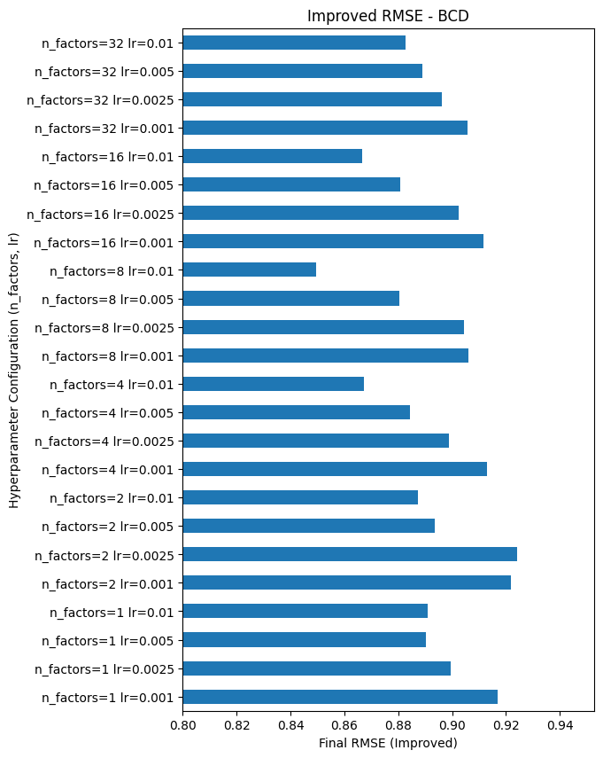

# Introduction
In this project, we attempt to develop a simple Recommender System. Given training data consisting of $m$ users and $i$ items. We would like to build a mathematical model that would enable us to predict the ratings of: 

1. new users on given items
2. new items by already existing users

# Notation
The matrix $W$ is an indicator matrix indicating whether an item $i$ was rated by a given user $u$. More formally: $W \in \mathbb{R}^{m, n}$ wwhere

$$
W_{u,i} = \begin{cases}1 & \text{if} (u,i)\in \Omega \\ 0 & \text{otherwise} \end{cases}$$

The ratings matrix is denoted by $X$. The known ratings can be mathematically expressed in matrix form as: 

$$ 
W \circ X
$$

where $\circ$ is the element-wise matrix product.

Further more we define: 

* $S_u$ as the set of users in the training data
* $S_i$ as the set of items in the training data.
* $\Omega$ as the set of pairs $(u, i)$ where user $u$ rated the item $i$

We assume that each item $i \S_i$ has been rated by at least one user, and similarly each user $u \in S_u$ rated at least one givem item.

# Baseline model

The initial step is to to build numerical / mathematical representations for both users and items denoted by $U \in \mathbb{R}^{m, k}$ and $V \in \mathbb{R}^{m, k}$ respectively. The $i$ -th row in $U$ represents the $i$ -th user and similarity, the $j$ -th row in $V$ represents the $j$ -th item.  

Modeling the rating of a the $i$ -th user $u$ to the $i$ -th item as the dot product between the representations, then one to `learn` good representations from the data is to minimize the following mathematical objective:

\begin{equation}
\min_{
    U\in\mathbb{R}^{m\times r}, V\in\mathbb{R}^{n\times r}} L_1 = \frac{1}{2} {\sum_{u=1}^m\sum_{i=1}^n W_{u,i}\left(X - UV^T\right)_{u,i}^2 + \lambda \cdot (||U_u||^2 + ||V_i||^2)
}
\end{equation}

For the $k$ -th user and the $j$ -th item, we define $ $ 

\begin{equation}
f_1(U_k, V_j) = \frac{1}{2} (X_{j, k} - U_k ^ T \cdot V_j) ^ 2 + \lambda \cdot (||U_u||^2 + ||V_i||^2)
\end{equation}

It is easy to see that 

\begin{equation}
L_1 = \sum _ {(i, j) \in \Omega} f_1(U_k, V_j)
\end{equation}

## Minimizing the optimizaton objetive

We consider 2 algorithms to solve the optimization problem $(1)$:

* Stochastic Gradient Desent (SGD)
* Block Coordinate Descent (BCD)

### SGD
Given $K$ as the number of iterations and $\alpha$ as the step size.

1. Initialize $V$ and $U$

2. For $k$ to $K$:
    1. iterate through all pairs rated (user, item) pairs, For the $j$ -th user and $k$ -th item: 

        * apply both updates simultaneously: 
            - $V_k \gets V_k - \alpha \cdot \frac{\nabla f_1(V_j, U_k)}{\nabla V_k}$ 
            
            - $U_j \gets U_j - \alpha \cdot \frac{\nabla f_1(V_j, U_k)}{\nabla U_j}$  

### BCD 
1. Initialize $V$ and $U$
2. For $k$ to $K$:
    1. iterate through all pairs rated (user, item) pairs, For the $j$ -th user and $k$ -th item: 
    
        1. update items representations: 
            - $V_k \gets V_k - \alpha \cdot \frac{\nabla f_1(V_j, U_k)}{\nabla V_k}$

    2. iterate through all pairs rated (user, item) pairs, For the $j$ -th user and $k$ -th item:

        1. update users representations: 
            - $U_j \gets U_j - \alpha \cdot \frac{\nabla f_1(V_j, U_k)}{\nabla U_j}$    

## Prediction

Prediction $\hat y$ for a $(u, i)$ pair is made as follows

$$

\hat y = \begin{cases} UV^T & \text{if}\  (u,i)\in \Omega \\ \mu & \text{otherwise} \end{cases}

$$

where $\mu$ is the average prediction computed from the training data 

$$
\mu = \frac{1}{\sum_{u=1}^m\sum_{i=1}^n W_{ij}}\sum_{u=1}^m\sum_{i=1}^n{W_{ij}X_{ij}}
$$

## Mathematical Derivations

The mathematical function $f_1$ is simple. Since the term $X_{j, k} - U_k ^ T \cdot V_j$, we have: 

\begin{align*}
    \frac{\nabla f(V_j, U_k)}{\nabla V_j} =  - ((X_{j, k} - U_k ^ T \cdot V_j) \cdot V_j - \lambda \cdot V_j)

\end{align*}

Similarly

\begin{align*}
    \frac{\nabla f(V_j, U_k)}{\nabla V_k} =  - ((X_{j, k} - U_k ^ T \cdot V_j) \cdot U_k -\lambda \cdot U_k )
\end{align*}

By defining $e_{i, u}$ as 
$$
e_{i, u} = X_{i, u} - U_u^T \cdot V_i
$$

The updates can be expressed as:

- $V_i \gets V_i + \alpha \left(e_{u,i}\cdot U_u - \lambda V_i\right)$
- $U_u \gets U_u + \alpha \left(e_{u,i}\cdot V_i - \lambda U_u\right)$

# Improved Model

The main downside of the baseline model is its inability to make prediction for users or items that do not have any ratings. The baseline model is capable to predict a rating for a $(u, i)$ pair only if such user such user $u \in \S_u$ and $i \in \S_i$.

$$

\min_{U\in\mathbb{R}^{m\times r}, V\in\mathbb{R}^{n\times r}} L_2 = \frac{1}{2} {\sum_{u=1}^m\sum_{i=1}^n W_{u,i}\left(X - \left(\mu + \beta_u + b_i +  UV^T\right)\right)_{u,i}^2} + \lambda \cdot (\beta_u + b_i + ||U_u||^2 + ||V_i||^2)
$$

where $\mu$ is the average rating, $\beta$ is the bias of each user, and $b$ is the bias of each item.

\begin{equation}
f_2(V_k, V_k, b_k, \beta_j) = (X_{j, k} - U_k ^ T \cdot V_j - b_k - \beta_j) ^  2 + \lambda \cdot (\beta_u + b_i + ||U_u||^2 + ||V_i||^2)
\end{equation}

It is easy to see that 

\begin{equation}
L_2 = \frac{1}{2} \cdot  \sum _ {(i, j) \in \Omega} f_2(U_k, V_j, \beta_k, b_j)
\end{equation}

## Minimizing the mathematical Objective

We used the same optimizers as as for the baseline model: 

### SGD

1. Initialize $V$ and $U$

2. For $k$ to $K$:
    1. iterate through all pairs rated (user, item) pairs, For the $j$ -th user and $k$ -th item: 

        * apply both updates simultaneously: 
            - $V_k \gets V_k - \alpha \cdot \frac{\nabla f_2(V_j, U_k, \beta_j, b_k)}{\nabla V_k}$

            - $U_j \gets U_j - \alpha \cdot \frac{\nabla f_2(V_j, U_k, \beta_j, b_k)}{\nabla U_j}$

            - $b_j \gets b_j - \alpha \cdot \frac{\nabla f_2(V_j, U_k, \beta_j, b_k)}{\nabla b_k}$

            - $\beta_j \gets \beta_j - \alpha \cdot \frac{\nabla f_2(V_j, U_k, \beta_j, b_k)}{\nabla \beta_j}$
    
            - Each update for a given parameter is carried out while fixing the others.

### BCD

1. Initialize $V$ and $U$
2. For $k$ to $K$:
    1. iterate through all pairs rated (user, item) pairs, For the $j$ -th user and $k$ -th item: 
    
        1. update $V$: 
            - $V_k \gets V_k - \alpha \cdot \frac{\nabla f_2(V_j, U_k, \beta_j, b_k)}{\nabla V_k}$

    2. iterate through all pairs rated (user, item) pairs, For the $j$ -th user and $k$ -th item:

        1. update $U$: 
            - $U_j \gets U_j - \alpha \cdot \frac{\nabla f_2(V_j, U_k, \beta_j, b_k)}{\nabla U_j}$

    3. iterate through all pairs rated (user, item) pairs, For the $j$ -th user and $k$ -th item:

        1. udpate $b$: 
            - $b_j \gets b_j - \alpha \cdot \frac{\nabla f_2(V_j, U_k, \beta_j, b_k)}{\nabla b_k}$
        
    4. iterate through all pairs rated (user, item) pairs, For the $j$ -th user and $k$ -th item:

        1. update $\beta$: 
            - $\beta_j \gets \beta_j - \alpha \cdot \frac{\nabla f_2(V_j, U_k, \beta_j, b_k)}{\nabla \beta_j}$

## Prediction

Prediction $\hat y$ for a $(u, i)$ pair is made as follows

$$\hat y = \begin{cases} \mu + \beta_u + b_i + UV^T & \text{if}\  (u,i)\in \Omega \\ \mu + \beta_u & \text{if}\  u\in S_u \text{ and } i\not \in S_i \\ \mu + b_i & \text{if}\  u\not\in S_u \text{ and } i \in S_u \\ \mu & \text{otherwise} \end{cases}$$

where $\mu$ is the average prediction as is equal to $$\mu = \frac{1}{\sum_{u=1}^m\sum_{i=1}^n W_{ij}}\sum_{u=1}^m\sum_{i=1}^n{W_{ij}X_{ij}}$$

## Mathematical Derivations

The mathematical function $f_2$ is fairly similar to $f_1$. The gradients for $f_2$ with respect to $U_k$ and $V_i$ are the same $f_1$. As for the $\beta_k$ and $b_j$, 

we proceed as follows: 

Since the term $X_{j, k} - U_k ^ T \cdot V_j -\mu - \beta_u - b_i$

\begin{align*}
    \frac{\nabla f_2(V_j, U_k, \beta_k, b_j)}{\nabla b_j} =  -  ((X_{j, k} - U_k ^ T \cdot V_j -\mu - \beta_u - b_i) - \lambda \cdot b_j)
\end{align*}

\begin{align*}
    \frac{\nabla f_2(V_j, U_k, \beta_k, b_j)}{\nabla \beta_k} =  - ((X_{j, k} - U_k ^ T \cdot V_j -\mu - \beta_u - b_i) - \lambda \cdot \beta_k)
\end{align*}

The updates can be expressed as:

- $V_i \gets V_i + \alpha \left(e_{u,i}\cdot U_u - \lambda V_i\right)$
- $U_u \gets U_u + \alpha \left(e_{u,i}\cdot V_i - \lambda U_u\right)$

By defining $e_{u,i}$ as $$e_{u,i} = \left(X - \left(\mu + \beta_u + b_i +  UV^T\right)\right)_{u,i}$$

The updates can be expressed as:

- $b_i \gets b_i + \alpha \left(e_{u,i} - \lambda b_i \right)$
- $\beta_u \gets \beta_u + \alpha \left(e_{u,i} - \lambda \beta_u\right)$
- $V_i \gets V_i + \alpha \left(e_{u,i}\cdot U_u - \lambda V_i\right)$
- $U_u \gets U_u + \alpha \left(e_{u,i}\cdot V_i - \lambda U_u\right)$

# Results

All the results were achieved using minibatch size of $128$, regularization $\lambda=0.02$ on across $20$ iterations (epochs) for every model. 

Final takeaways:

- Block Coordinate Descent was show to be more stable during training than SGD.
- The choice of correct step size (leaning rate) is vitally important to solve the task.
- Both models achieve comparable results of  $\text{RMSE} \approx 0.86$.
- Number of factors beyond $4$ does not substantially decrease $\text{RMSE}$.

## Final RMSE using SGD 

## Final RMSE using SGD

## Delta loss

## Delta MAE

## Delta RMSE

